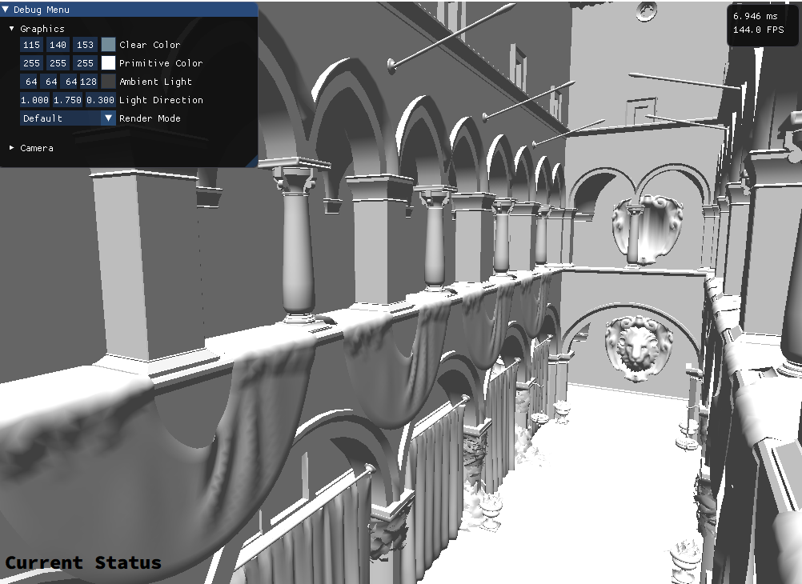
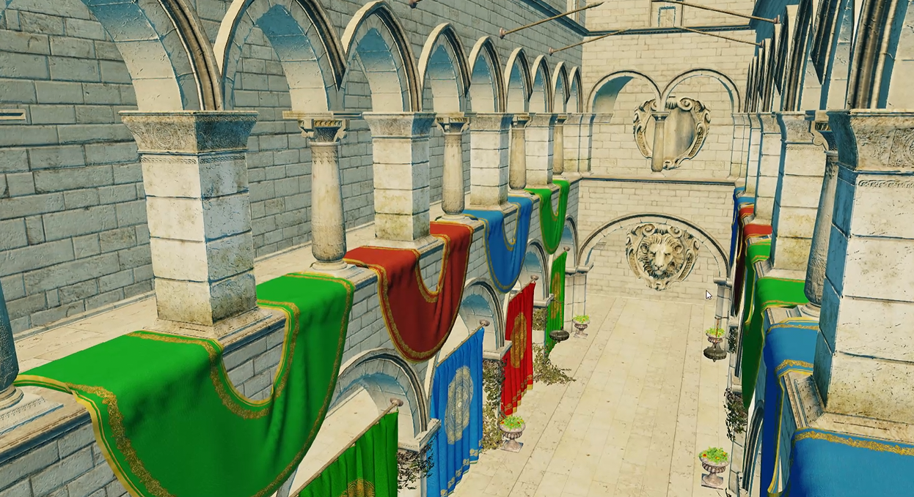
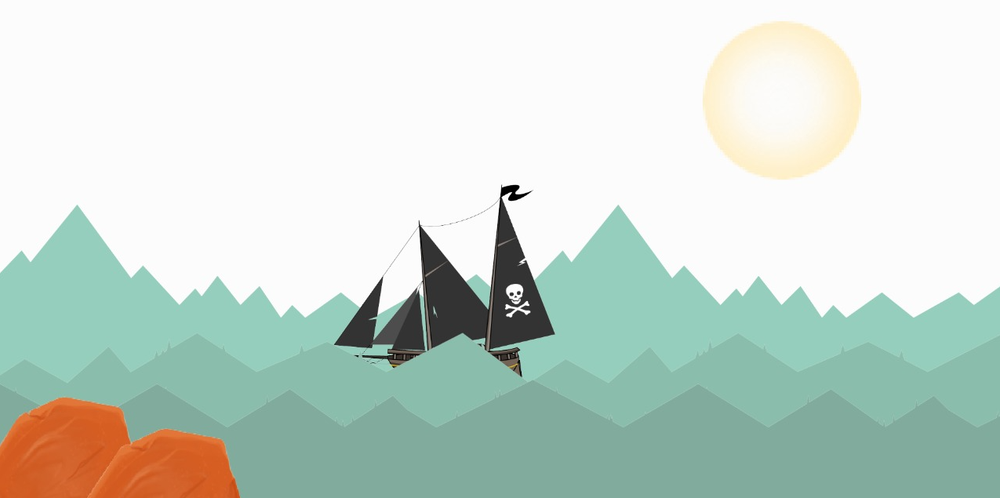
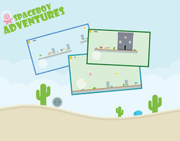

# Professional Portfolio
---
## [Apex Engine]

After the release of Call of the Wild: TheAngler, I moved on to Central Technology Group, where I started as a programmer, later got promoted to a senior position and moved up to take the lead of the engine team.
Here are some of my responsibilities as an Engine Programmer in Central Technology Group:-

- Managing the team of five Senior Engine Programmers in Central Tech Group
- Handling recruitment for the Engine team
- Liaison for Game Projects for console platform in Central Tech Group
- Worked on core systems of the engine and console platform support
- Collaborated with developer support team on CI/CD pipeline and workflows
- Part of the coding standards board of Avalanche
- Extended Haptics system and added tooling around it for the content creators
- Handled low level systems like Input / Memory Management etc
- Maintained and implemented platform abstraction for first party APIs
- Contributed to the engine direction and API design
- Working on engine improvements and engine upgrades for game teams

---
## [Call of the Wild: TheAngler]

A fishing game which extended the world for the currently popular hunting game, Call of the Wild: theHunter.
I worked as a sole Engine Programmer and was a liason for multiple programmers across the company for platform specific implementations. A non-exhaustive list of things I did while in the team:-
- Managed and mentored a few external co-dev engineers with PS4 and XboxOne port.
- Liaison for all engineers in the team and in Central Tech Group with ownership of Console platforms
- Implemented Haptics tech for PS5 / DualSense gamepad
- Assisted production in planning out the console work from production to shipping
- Implemented systems for the first party interactions for PS5, GDK and Epic Games (Achievements, DLC, User Handling… etc)
- Worked on first party certification for Sony and Microsoft platforms

---
## [Unannounced Ubisoft AAAA]

An Unannouced big budget project which we partnered with Ubisoft Reflections and worked with the Lead Programmer and production to guide the team and map out the future work. A brief highlight is below:-
- Mentored and managed the new engine team.
- Worked on Xbox Series X in pre-production.
- Handled API abstraction and low-level implementations such as; Direct Storage, Threading, Save System.

---
## [Prince of Persia: The Sands of Time Remake]

A remake of an iconic game introduced to the world by Ubisoft Montreal back in 2003.  
I worked as an Engine programmer and a Technical Artist on this project.  

### Engine Programmer
As an Engine Programmer, I was responsible for upkeep, memory management, performance, and feature parity for the consoles (Xbox One and PlayStation 4).
A brief summary of what I worked on:-
- Worked on platform specific features such as; TRC/XRs, SDK Upgrades, PlayGo, Achievement System Implementation, DLC System Implementation, Save System
- Worked on initial PS5 support for the PS4 title.
- Worked on memory optimization and performance for all platforms.
- Managed some 3rd Party SDK integrations and upgradation such as; Simplygon, Oodle, Bink
- Implemented Oodle Compression pipeline, worked on optimization and cleanup for engine data & binarization
- Analyzed GPU hangs/crashes and assisted Graphics team for their solutions.
- Ported legacy code for Prince of Persia 1 (1989) from C to C++.
- Worked on upgrading language support from C++11 to C++17 version.
- Worked on PC security implementation (anti-cheat) for data. Modified in-house gameplay languages and parsers to add support for the same.
- Worked on several PC requirements such as; graphic options, display options, multi-monitor support, letterboxing.

### Technical Artist
As a Technical Artist, I was responsible for maintaining the structure of the content, the internal pipeline tools, and establish direction of optimized content across multiple disciplines of the art team.
Few highlights from my time as technical artist:-
- Worked on planning out the memory and frame time budgeting and optimization.
- Worked on automating certain workflows for the art, VFX, and animation team.
- Worked on engine plugins and tools for artists, VFX team, and animators
- Maintaining custom plugins for Photoshop, 3DS Max and Motionbuilder.
- Added asset validation scripts to streamline and mitigate errors in the art workflow.

---
## [Trials Frontier]

The mobile version of the best-selling and critically-acclaimed Trials series.  
I worked on this as a Gameplay Programmer. My responsibilities were as follows but not limited to:-
- Bringing crash ration down and work on general stability of the game across multiple devices
- Integrate, upgrade and remove legacy such as; Ad SDKs such as AdMod, HyperMX.
- Added preliminary support for Android P beta for the game.
- Added new game FTUE flow, and new user events that empowers user engagement and assists new players.
- Added a new in-game currency type for X-Games monthly event
- Added a generic and scalabe monthly event UI template to assist the sunset of the game and make it configurable from content
- Added initial notch-support implementation for the first gen notch phone - iPhone X

# Personal Projects
---
## Custom Engines

I made a few small engines at home to sandbox and test out code and play around with graphics. Two of the visual ones are below.

| [DX12 Engine]                                                           | [DirectX 9 Renderer]                                        |
|:----------------------------------------------------------------------- |:----------------------------------------------------------- |
|  |  |
| Deffered Batched Rendering                                              | Normal Mapping                                              |
| ImGui Debug UI                                                          | Blinn-Phong Shading                                         |
| Premake Driven VS Solution                                              | Global Tonemapping                                          |
| Experimenting with boost::serialization for Data                        | Shader Hot-Reload                                           |
| Experimenting with boost::signal for Events                             | Gamma Correction                                            |
| Try-out at platform abstraction                                         | Asset loading via assimp                                    |
| File Watcher, Logger, CpuTimer, and some other basic engine systems     | Forward Batch Rendering                                     |
| Experimenting with Native Win32 File I/O API                            | Project [**Video**]                                         |

---
## [Renderz]

An open source WebGL 2.0 2D rendering engine written in JS. Features a simplistic API which is easy for any novice to use.  
It showcases the following:
- Texture support
- Simple Geometry
- Animation through interpolation via shaders  

This was made for a minor systems project showcase for the university

---
## [Little JSON Reader]
Open source lightweight JSON parser with read only functionality written in C++.

---
## [Spaceboy Adventures]

SpaceBoy Adventures is a 2D side-scroller platformer which requires you to reach your home at the end.  
You have to avoid the alien creatures and collect coins which score you some points.  
When you reach your home, it spawns you onto the next level.  
If you die, you're back at the current level.  
There's a trigger at the bottom of the level to fall into the water making the player drown.

[Call of the Wild: TheAngler]: https://cotwtheangler.com/
[Prince of Persia: The Sands of Time Remake]: https://www.ubisoft.com/en-us/game/prince-of-persia/sands-of-time-remake
[Trials Frontier]: https://trials.fandom.com/wiki/Trials_Frontier
[DX12 Engine]: https://github.com/codenameone-akshat/anarchyengine/
[DirectX 9 Renderer]: https://github.com/codenameone-akshat/D3D9_Renderer/
[Renderz]: https://github.com/codenameone-akshat/Renderz/
[Little JSON Reader]: https://github.com/codenameone-akshat/LittleJsonReader/
[Spaceboy Adventures]: https://github.com/codenameone-akshat/SpaceBoy-Adventures/
[**Video**]: https://drive.google.com/file/d/1JGaVfsEu-H6cXR4YkuKRZfWWDbGawHqu/view?usp=sharing
[Apex Engine]: https://avalanchestudios.com/technology
[Unannounced Ubisoft AAAA]: ../notfound/
